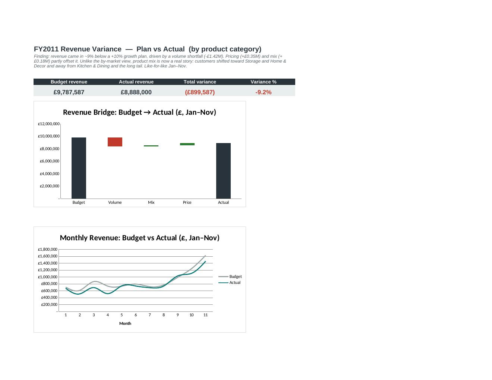

# FP&A Revenue Variance Analysis — Price / Volume / Mix

A driver-based revenue plan and a **price/volume/mix variance bridge**, built on a clean
SQL pipeline over the real **UCI Online Retail II** dataset (~1.07M transactions) and an
Excel model. The question it answers is the everyday FP&A one: *the number missed the plan
— why, and what should we do about it?*

Two cuts of the same analysis:
- **v1 — by market** (`model/FPA_Variance_by_market.xlsx`): segments revenue by country.
- **v2 — by product category** (`model/FPA_Variance_by_category.xlsx`): segments by product line, where mix becomes a real driver.



---

## The finding

On a like-for-like **Jan–Nov 2010 → 2011** basis, against a plan of **+10% volume / +3% price**:

| | |
|---|---:|
| Budget revenue | £10.24M |
| Actual revenue | £9.20M |
| **Total variance** | **−£1.04M (−10.1%)** |

Decomposed:

| Driver | Effect | Read |
|---|---:|---|
| **Volume** | **−£1.48M** | The +10% growth plan was too aggressive; real volume fell well short |
| **Mix** | **+£0.12M** | Slightly favorable market mix |
| **Price** | **+£0.32M** | Realized prices ran ahead of the +3% plan — a genuine cushion |

**Takeaway:** revenue still grew ~2% year-over-year, but came in ~10% below an ambitious plan,
and the gap is almost entirely a **volume miss**. Pricing held up better than planned and softened
the blow. The actionable read for a planner: the growth assumption needs resetting; pricing is a
strength to protect.

> The variance is measured against the plan you set. Change the assumptions and the story changes —
> that is the point of the model, not a caveat.


### v2 — by product category

Same plan, segmented by product line instead of market. Variance −£0.90M (−9.2%): again a volume
shortfall (−£1.42M), cushioned by price (+£0.35M) and — the v2 payoff — **a meaningful mix story**.
Beneath a modest +£0.18M net mix, customers shifted **toward Storage (+£0.36M) and Home & Décor**
and **away from Kitchen & Dining and the long-tail Other**. In v1 (UK = 85% of revenue) mix was a
rounding error; segmenting by product is what makes the mix dimension actually informative.

---

## A real-data judgment call (worth noting in interview)

December 2011 is **truncated** in the source — the data ends mid-December, so Dec 2011 revenue is
~half of Dec 2010. Comparing full years would invent a false ~£0.6M shortfall. The analysis therefore
compares **like-for-like Jan–Nov** for both years. Spotting and handling that is the difference between
a number and an honest number.

---

## What this demonstrates

- **Quantitative modeling** — a driver-based plan (units × price, per segment) from editable assumptions.
- **Investigative analysis** — a price/volume/mix bridge that explains *why* actual diverged from plan.
- **SQL / data tooling** — a DuckDB pipeline cleaning 1.07M real, messy rows into a tidy fact table.
- **Working with unstructured / imperfect data** — cancellations, missing IDs, bad prices, and a
  truncated month, all identified and handled deliberately.

---

## Architecture

Four stages, one direction. Raw data is never edited; every step is reproducible.

```
data/raw/online_retail_II.csv  ─►  DuckDB (sql/)  ─►  data/processed/monthly_fact.csv  ─►  Excel model
   (immutable real input)          (clean+segment)        (handoff: one tidy table)        (plan + bridge)
```

1. **Raw** — ~1.07M Online Retail II transactions.
2. **SQL (DuckDB)** — drops cancellations / bad prices, buckets countries into six market segments,
   aggregates to `Year × Month × Segment` (units, revenue, avg price).
3. **Processed** — one clean fact table, the handoff to Excel.
4. **Excel** — assumptions → budget → actual → price/volume/mix bridge. Tabs: Dashboard · Model ·
   Assumptions · Data · Notes.

---

## Data quality (real numbers from the pipeline)

- **1,067,371** raw rows → **1,041,670 kept (97.6%)**.
- Dropped ~2.4%: cancellations (19,494 'C' invoices), non-positive quantities, non-positive prices.
- **243,007** rows have no Customer ID — **retained**, because revenue = qty × price doesn't need it.
- Segment = market: **United Kingdom (~85% of revenue)** + EIRE, Netherlands, Germany, France, Other.

---

## How to run

```bash
# 1. SQL step — produces data/processed/monthly_fact.csv
duckdb < sql/build_fact_table_by_market.sql      # run from the project root

# 2. Model — open model/FPA_Variance_Model.xlsx
#    The Data tab holds the pipeline output; everything recalculates from it.
#    Change any input on the Assumptions tab and the model + bridge update.
```

Get the data: download **Online Retail II** from the UCI Machine Learning Repository, save it as
`data/raw/online_retail_II.csv`. (The raw file is not committed — see `.gitignore`.)

---

## Repo structure

```
fpa-variance-analysis/
├── data/
│   ├── raw/         online_retail_II.csv          (real input — download; not committed)
│   └── processed/   monthly_fact.csv              (pipeline output)
├── sql/
│   ├── build_fact_table_by_market.sql             v1 pipeline
│   └── build_fact_table_by_category.sql           v2 pipeline (keyword category mapping)
├── model/
│   ├── FPA_Variance_by_market.xlsx                v1 — segmented by country
│   └── FPA_Variance_by_category.xlsx              v2 — segmented by product category
├── docs/
│   └── dashboard_preview.png
├── tools/                                          dev utility (model builder)
└── README.md
```

---

## Notes & honesty

- The **price/volume/mix** formulas and their tie-out are documented on the model's **Notes** tab
  (the bridge check on the Model tab equals ~£0).
- The budget is a **constructed plan** for this exercise, not a real company plan; the finding is
  conditional on the assumptions, which are editable.
- **v2 idea:** segment by *product category* (derived from item descriptions) instead of market.
  The UK is ~85% of revenue, so cross-market mix is small by construction; a product-category cut
  would surface a richer mix story.
